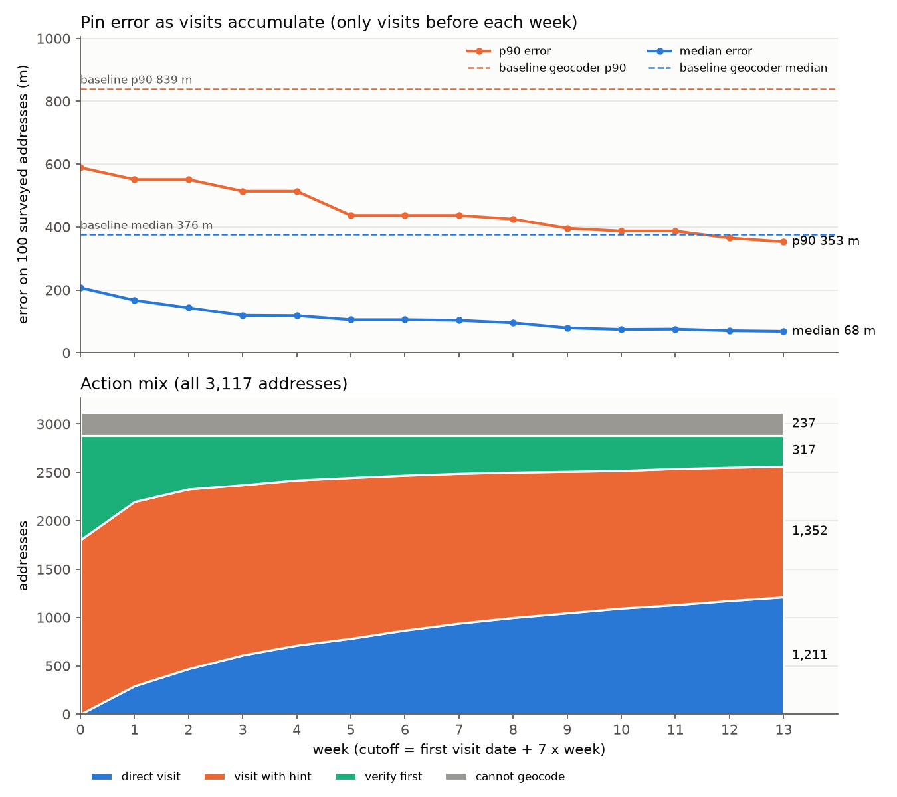

# PS3 – Address geocoder that learns from field visits

Final write-up. On the 100 surveyed addresses, the median pin error drops from 376 m (the
baseline geocoder) to **68 m**, and the p90 from 839 m to **353 m**. Pins built from visits are a
median 10 m off. Every pin carries a calibrated 90% radius (R90; 5-fold CV coverage 0.91), a field action and a landmark hint.

## Problem
Collection agents visit borrowers at addresses like "6th Cross, 5th Main, near church,
Kuvempu Layout". These addresses are descriptions, and the commercial geocoder usually drops
the pin at a locality or pincode centroid. The agent then searches the wrong area and records
`address_not_traceable`. The goal is to give each of the 3,117 addresses:
- a pin (x, y),
- an honest R90: the house is inside this circle 90% of the time,
- an action: DIRECT_VISIT, VISIT_WITH_HINT, VERIFY_FIRST (phone first) or CANNOT_GEOCODE
  (outside the service area: no pin),
- a landmark hint in the town's own wording.

The system learns from the 5,578 past field visits, and every new visit improves the pins.

## Data
- Coordinates are metres on a separate grid per town, so (x, y) always goes with `town_id`.
- 3,117 addresses in T1, T2 and T3, plus 237 marked OUT (out of service area: no pin, action
  CANNOT_GEOCODE).
- 5,578 visits, each with a check-in, a GPS breadcrumb trail, an outcome, a remark and a
  photo hash.
- A map of 241 POIs in exactly 14 landmark types, and locality centroids.
- `surveyed_addresses.csv` gives the true location of 100 addresses (66 train, 19 validation,
  15 test). It is the answer key, and only `evaluate.py` reads it.
- How close a check-in is to the door depends on the outcome:
  - met_family / locked_premises / neighbour_says_shifted: about 15–20 m
  - met_borrower: about 35–40 m (the borrower may be met at a shop or at work)
  - address_not_traceable: the agent searched here and failed. These visits are only ever used
    as negative evidence.
- One agent made fake visits: the same photo hash reused across accounts, plus check-ins in a
  single 50 m hotspot cell. Rules flag 231 visits: 162 by photo reuse, and 69 only by the
  hotspot rule. No agent_id is hard-coded.

## Approach (one paragraph per step)
**1. Load** (`load.py`). Joins addresses, accounts, lenders, splits and baseline pins. Reduces
each visit's GPS trail to a few numbers: duration, path length, straightness, trail end and
dwell time at the end. `check_pins` asserts one row per address in every pins file.

**2. Scorer** (`evaluate.py`). The only reader of the answer key. Reports median, p90, % within
100 m / 300 m and R90 coverage, by split and by pin source, and appends one row per run to
`outputs/scoreboard.csv`. Other code receives only per-address errors, through
`address_errors`.

**3–4. Parse** (`lexicon.py`, `textparse.py`). Cleans the address text, then extracts the
pincode, door number, cross/main/block/road/gali, locality, the landmark (one of the 14 map
types) and its relation (NEAR, OPPOSITE, BEHIND, …). The lexicon covers English, Hindi and
Kannada, in their own scripts and in Latin spelling.

**5. Text prior** (`prior.py`). Picks a pin and a sigma from the best available evidence, in
this order:
1. a baseline rooftop or street pin
2. the matching POI within 550 m of the locality
3. the locality centroid
4. the pincode-area baseline pin

Result: 207 m / 589 m.

**6. Visit position from the GPS trail** (`load.py`). A visit's position is the centroid of the
trail's stationary tail: the trailing run of steps shorter than 15 m, plus the point where that
run starts. It is used when the tail has at least 2 points (56% of visits); otherwise the
check-in is used. `checkin_x/y` are kept, and `visit_evidence.csv` has both. The fake-visit
rules still use the raw check-in. On train, positions agree with the other reliable visits
about twice as closely as check-ins do: for met_family, a median of 24 m vs 46 m from the
leave-one-out consensus. Re-tuning the outcome sigmas on these positions pushed four of them
to the 5 m grid floor. Single visits then won cluster ties (one surveyed visit pin went from
19 m to 209 m). The train holdout also got worse: 40 instead of 35 of 203 addresses over
100 m. So the check-in-era sigmas are kept, and the retune is recorded as dropped.

**7. Visit evidence and integrity** (`evidence.py`). Each positive visit gets a sigma from:
- its outcome,
- its GPS accuracy,
- the distance between the check-in and the end of the GPS trail,
- an agent reliability factor fitted leave-one-out on train.

Fake visits are flagged by photo-hash reuse (≥ 3 accounts) and by per-agent hotspot cells.

**8. Remark corrections** (`remarks.py`). Some remarks say where the house really is, e.g.
"asli ghar X ke peeche hai" ("the real house is behind X"). The landmark in the remark is
resolved to the nearest POI of that type within 400 m of the check-in, with a sigma of
122 m + 39 m per "N cross ahead". This clue breaks near-ties between visit clusters and is one
more capped point in the fused median.

**9. Fusion** (`fuse.py`). The pin is a robust weighted median of the prior and the kept
visits:
- no single agent may hold more than 50% of the weight;
- visits are grouped into 100 m clusters, and the heaviest cluster is kept (in a tie, the one
  nearer the prior);
- points more than 3σ out are trimmed;
- each not-traceable check-in near the prior widens the prior's sigma by ×1.47.

Result: 78 m / 425 m.

**10. Neighbour street keys** (`neighbours.py`). Houses that share cross + main, block + road,
block or gali are close together. The median of the neighbours' visit pins becomes a clue.
Its sigma is fitted leave-one-out on train, and the building-name key was dropped because it
was not reliable. The clue is merged into the prior in a second fusion pass, where it may hold
at most 0.5× the address's own visit weight. Result: 67 m / 353 m (68 m / 353 m after Step 6).

**12. Calibration** (`calibrate.py`). Split-conformal R90 = q·sigma, with q fitted on
train+validation only. There is one q for visit pins and one for text pins (see below). The
action follows from R90: ≤ 100 m DIRECT_VISIT, ≤ 500 m VISIT_WITH_HINT, otherwise
VERIFY_FIRST. OUT addresses have no pin and get CANNOT_GEOCODE (Step 9).

**14–15. Directions and outputs** (`outputs.py`). Each direction names the nearest POI within
200 m of the pin, with the distance and compass bearing, in the town's own style:
- T1: "Anjaneya Gudi hattira, ~40 m east"
- T2: "Masjid ke paas, ~190 m dakshin-paschim"
- T3: "60 m west of Bus Stop"

Then come the agents' remark hint, any visual door cue from the remarks (Step 7c, e.g.
"Look for: blue gate"), and the search radius or a phone-first warning. The step writes one
file per consumer (see below).

**16. Learning over time** (`replay.py`). Rebuilds every pin weekly using only the visits
before each cutoff, through the same code path, with frozen parameters (see below).

**Tried and dropped (5b).** In a near-tie, prefer the cluster that holds the correction visit.
On the train holdout it changed 4 pins and made all 4 worse, so it was dropped.

## Ablation (100 surveyed addresses)
| version | median | p90 | within 100 m | within 300 m |
|---|---|---|---|---|
| baseline geocoder | 376 m | 839 m | 9% | 38% |
| text prior, existing repo parser | 243 m | 1,703 m | 17% | 55% |
| text prior, new parser (Steps 3–5) | 207 m | 589 m | 16% | 61% |
| + visits + integrity + fusion (cluster nearest prior) | 119 m | 425 m | 48% | 79% |
| + keep largest visit cluster (tie → nearest prior) | 78 m | 425 m | 52% | 79% |
| **+ neighbour street-key evidence (Step 10)** | **67 m** | **353 m** | **57%** | **85%** |
| + remark corrections (Step 8) | 67 m | 353 m | 57% | 85% |
| (5b, dropped) near-tie → cluster holding a correction visit | 67 m | 353 m | 57% | 85% |
| (6, dropped) trail-centroid positions + retuned outcome sigmas | 70 m | 353 m | 56% | 85% |
| **+ trail-centroid visit positions (Step 6, old sigmas)** | **68 m** | **353 m** | **57%** | **85%** |
| (7a, dropped) baseline street / rooftop sigma 97 / 15 m (was 100 / 50) | 68 m | 353 m | 58% | 85% |
| (7b, dropped) down-weight prior clues searched by failed visits (100 m, sigma ×3) | 68 m | 353 m | 57% | 85% |
| + door cues in directions (7c, no pin change) | 68 m | 353 m | 57% | 85% |
| + dispatch channel / dialer campaign / voice-bot prompt (7d, no pin change) | 68 m | 353 m | 57% | 85% |
| (8b, dropped) stationary-dwell positions + retuned outcome sigmas | 74 m | 353 m | 55% | 85% |
| **+ stationary-dwell visit positions (8a, old sigmas)** | **68 m** | **353 m** | **57%** | **85%** |
| + CANNOT_GEOCODE action for OUT (Step 9, label only, no pin change) | 68 m | 353 m | 57% | 85% |

Step 6 was chosen on the train holdout (203 addresses; stand-in truth = the hidden reliable
visits), not on surveyed errors:

| variant | median | p75 | p90 | > 100 m |
|---|---|---|---|---|
| check-in positions (before Step 6) | 21 m | 64 m | 132 m | 35 |
| trail-tail positions + retuned sigmas | 18 m | 74 m | 143 m | 40 |
| **trail-tail positions + old sigmas (used)** | **16 m** | **53 m** | 132 m | **33** |

On the surveyed addresses, the visit pins improve from 17 m / 67 m to 10 m / 62 m. The overall
median moves from 67 m to 68 m because the 50th of 100 errors falls on a text-only pin.

**Step 7: ideas borrowed from a teammate's version.** Each idea is tried alone and kept only if
the train holdout is not worse. Two checks are used:
- P: the text prior against the train stand-in truth, as if the address had no visits;
- H: the fusion holdout above.

*7a, dropped: trust baseline street / rooftop pins more.* On train, the baseline pin alone is
a median 115 m off for street pins (73 rows) and 18 m off for rooftop pins (9 rows). The
fitted sigmas (median / 1.18) are therefore 97 m and 15 m; the current values are 100 m and
50 m.

| variant | P: affected rows (82) median / p90 | P: within 2.15σ | H median / p75 / p90 | H > 100 m |
|---|---|---|---|---|
| current 100 / 50 | 92 / 185 m | 0.89 | 16 / 53 / 132 m | 33 |
| 60 / 30 | 90 / 196 m | 0.68 | 17 / 53 / 132 m | 33 |
| fitted 97 / 15 | 90 / 186 m | 0.87 | 16 / 53 / 130 m | 32 |
| rooftop only 100 / 15 | 92 / 185 m | 0.87 | 16 / 53 / 130 m | 32 |
| use the baseline pin directly | 106 / 211 m | 0.00 | 20 / 92 / 165 m | 47 |

None of them clearly beats the current values:
- Lowering the sigma helps 6 of the 9 rooftop rows but makes the radius overconfident
  (within 2.15σ on rooftop rows: 0.78 → 0.56).
- Using the baseline pin directly is clearly worse.
- On the surveyed addresses, the fitted 97 / 15 also scores 68 m / 353 m.

*7b, dropped: negative evidence from failed-visit GPS trails.* The text prior combines several
clues: locality centroid, landmark POI and baseline pin. For each clue, we took the closest
any non-fake not-traceable agent came to it, using every trail point plus the check-in. A
clue searched within R had its sigma multiplied by F, and the prior was recomputed. Agents
search right at the baseline pin (a median 5 m from it), at the locality centroid (67 m) and
at the landmark (192 m). This touches 708–724 addresses.

| variant | P: addresses with a failed visit (210) median / p75 / p90 | P: within 2.15σ | H median / p75 / p90 | H > 100 m |
|---|---|---|---|---|
| none (current) | 262 / 493 / 1,868 m | 0.65 | 16 / 53 / 132 m | 33 |
| R 50 m, ×2 | 273 / 470 / 1,847 m | 0.79 | 16 / 62 / 132 m | 33 |
| R 100 m, ×3 | 285 / 468 / 1,831 m | 0.82 | 16 / 54 / 132 m | 33 |
| R 150 m, ×5 | 304 / 493 / 1,821 m | 0.85 | 16 / 56 / 132 m | 33 |

The full grid was R ∈ {50, 100, 150} m and F ∈ {2, 3, 5}.

Down-weighting what was searched trims the p75/p90 tail slightly and makes the sigma more
honest. But it always worsens the median, because it pulls the pin away from the baseline
pin toward a coarser clue, and the holdout p75 gets worse as well. The existing rule
(widen the prior ×1.47 per failed check-in near it) stays. On the surveyed addresses,
R 100 m ×3 scores 68 m / 353 m (test p90 2,762 → 2,778 m).

*7c, kept: visual door cues.* `remarks.remark_cues` reads colour + gate in English, Hindi and
Kannada (blue/neela/neeli, green/hara/hasiru, red/laal/kempu, …), corner house, and floor
("2nd floor", "3ne maadi"). Only non-fake positive visits count, and the most-reported cue
comes first. The cue is added to the directions, e.g. "Dawai ki Dukaan ke paas, ~170 m purab.
Agents report: Dawai ki Dukaan ke right side. Look for: blue gate. ~50 m ke andar dhoondo".
In this data only "blue gate wala ghar" occurs (93 remarks), so 85 addresses get a cue (61 in
T2, 24 in T3). Pins do not change.

Remark corrections do not change the surveyed score: only 9 surveyed addresses have a
correction, and their visit pins were already 5–15 m off. On the train holdout (39 addresses
with a correction) they cut p90 from 166 m to 80 m.

On the train split, the neighbour clue's median error by street key (leave-one-out) was:

| key | clue median error | text prior on the same rows |
|---|---|---|
| cross + main | 63 m | 185 m |
| block + road | 91 m | 192 m |
| block | 144 m | 247 m |
| gali | 236 m | 201 m |
| building name | 376 m | dropped |

**Step 8: stationary-dwell visit positions (idea from the TISK branch, reimplemented).**
`load.stationary_dwell` finds stops in each GPS trail. A point is stationary when its speed is
< 0.4 m/s and its accuracy is <= 20 m. A run of stationary points counts when it has >= 2
points, lasts >= 120 s and stays within 15 m of its centroid. The dwell position is the
accuracy-weighted mean (1/acc^2) of the longest such run. 2,153 of 5,578 visits have one.

The position source was chosen per outcome on train only. Stand-in truth is the leave-one-out
median check-in of the other reliable visits at the address. Errors in m (median / p90) on
visits that have all three positions:

| outcome | n | check-in | trail tail | dwell | chosen |
|---|---|---|---|---|---|
| met_family | 221 | 22.9 / 84.7 | 15.7 / 70.3 | 15.3 / 68.1 | dwell |
| neighbour_says_shifted | 105 | 23.4 / 63.3 | 14.4 / 38.9 | 14.4 / 38.8 | dwell |
| met_borrower | 193 | 34.2 / 186.2 | 17.6 / 185.6 | 18.0 / 187.3 | tail |
| locked_premises | 67 | 17.8 / 57.4 | 12.6 / 51.5 | 11.6 / 52.4 | tail |
| cash_collected | 17 | 19.3 / 153.2 | 10.6 / 144.6 | 10.7 / 145.3 | tail |
| no_such_person | 14 | 21.1 / 104.3 | 17.0 / 91.5 | 15.2 / 92.7 | tail (too few) |

Where both exist, tail and dwell are within 1 m, so the lower p90 decided. With tail positions
as the truth instead, dwell edges ahead for met_borrower (8.1 vs 9.1 m); either way it is a
tie. The real gain is the fallback order dwell -> tail -> check-in. On train, 425 positive
visits have a dwell but no stationary tail. Their check-in is a median 101–198 m off by
outcome, but the dwell is only 8–19 m off (met_family 114 -> 13 m, met_borrower 102 -> 15 m).

Re-tuning the outcome sigmas on the new positions (8b) again pushed every base to the 5 m
floor, with k_trail 0. The median rose to 74 m and the visit-pin p90 to 97 m, so 8b was
dropped and the old sigmas are kept. 8a: overall 68 / 353 m, unchanged. Visit pins went from
10 / 62 m to 8 / 61 m, validation median from 14 to 9 m, and the visit-pin median R90 from
51 to 35 m. Coverage is 0.89 (was 0.90), and 5-fold CV coverage is 0.92 (was 0.91). The fake-visit
flags are unchanged: 231, all from one agent (the hotspot rule uses check-ins, not positions).

## Final evaluation
Run by `python src/final_eval.py` (→ `outputs/final_results.csv`). The test split was scored
once, at the end. Pins never use the answer key, so the error on every split is a held-out
number and needs no cross-validation. Only R90 is fitted on surveyed errors. Its coverage is
therefore shown two ways:
- per split, with the frozen q (fitted on train+validation);
- 5-fold CV over all 100 addresses, with q refitted on the other folds.

**The test split has only 15 addresses.** Its p90 is the second-worst of 15 errors, so one or
two pincode-only addresses decide it.

| split | n | baseline median / p90 | final median / p90 | within 100 m (base → final) | within 300 m (base → final) | R90 coverage (frozen q) | R90 coverage (5-fold CV) | median R90 |
|---|---|---|---|---|---|---|---|---|
| train | 66 | 381 / 746 m | 86 / 357 m | 9% → 53% | 33% → 82% | 0.91 | 0.95 | 210 m |
| validation | 19 | 194 / 804 m | 9 / 154 m | 11% → 79% | 58% → 100% | 0.95 | 0.95 | 38 m |
| **test** | **15** | 455 / 2,845 m | **102 / 2,762 m** | 7% → 47% | 33% → 80% | **0.73** | 0.73 | 272 m |
| **all** | **100** | 376 / 839 m | **68 / 353 m** | 9% → 57% | 38% → 85% | 0.89 | **0.92** | 184 m |

The table below splits the same 100 addresses by the source of the final pin. The baseline
column shows the baseline geocoder's error on those same addresses.

| final pin source | n | baseline median / p90 | final median / p90 | within 100 m | R90 coverage (CV) | median R90 |
|---|---|---|---|---|---|---|
| visits | 45 | 384 / 1,366 m | **8 / 61 m** | 93% | 0.93 | 35 m |
| neighbours | 9 | 363 / 528 m | 82 / 221 m | 56% | 0.89 | 194 m |
| landmark | 28 | 384 / 772 m | 171 / 348 m | 11% | 0.89 | 329 m |
| locality | 10 | 383 / 612 m | 326 / 551 m | 20% | 1.00 | 569 m |
| baseline street / rooftop | 5 | 26–106 m | 17–86 m | 100% | 1.00 | 132–216 m |
| pincode_area | 3 | 2,202 / 4,286 m | 2,106 / 4,224 m | 0% | 0.67 | 2,278 m |

The 1,255 addresses with their own visit pin are where the system is strongest: about 8 m.
Text-only pins improve on the baseline, but they stay at hundreds of metres, and their wide
R90 sends many of them to VERIFY_FIRST. Final scoreboard row:
`9 CANNOT_GEOCODE label for OUT,all,100,68,353,0.57,0.85,0.89,184` (same as Step 8a).

## Confidence radius (R90) and action (Step 12)
For each pin, score = error / sigma. q is the ceil((n+1)·0.9)-th smallest score on
train+validation (n = 85), and radius_90 = q·sigma. The current q values are in
`outputs/calibration_q.json`.

| R90 variant | q | train+val coverage (text / visits) | test coverage (n=15) | 5-fold CV coverage (text / visits) | CV median R90 |
|---|---|---|---|---|---|
| A: one q | 2.50 | 0.87 / 0.98 | 0.80 | 0.91 (0.85 / 0.98) | 199 m |
| **B: q per group (used)** | visits 1.41, text 2.68 | 0.93 / 0.92 | 0.80 | 0.91 (0.91 / 0.91) | 235 m |

The choice between A and B is made by a fixed rule on train+validation only, before looking
at test or CV. Under A, the two groups' coverage is uneven: visit pins are over-covered and
text pins under-covered. The rule therefore picks B. Under B, visit pins get a median R90 of
52 m instead of 92 m.

Actions for all 3,117 addresses (Step 9): DIRECT_VISIT 1,211 · VISIT_WITH_HINT 1,352 ·
VERIFY_FIRST 317 · CANNOT_GEOCODE 237. The 237 CANNOT_GEOCODE addresses are exactly the OUT
addresses: they have no pin and no R90. VERIFY_FIRST is mostly locality pins (261) and
pincode-area pins (48) whose R90 is over 500 m. Before Step 9, the OUT addresses were counted
under VERIFY_FIRST (554 = 317 + 237). The pins and R90 are the same either way.

## Learning over time and not-traceable visits (Step 16)
`replay.py` rebuilds every pin as if the pipeline had run on an earlier date. Only visits
dated before the cutoff are used, through the same code (`build_evidence` → `build_pins` →
`apply_q`). Integrity flags and agent factors are recomputed on the visits seen so far. q is
frozen from `calibration_q.json`. The sigmas and q were tuned on the full data, so early weeks
benefit slightly from later information, but the pins themselves use only past visits. The
last week reproduces `pins_final.csv` exactly (asserted).



| week | visits used | median | p90 | R90 coverage | DIRECT_VISIT | VISIT_WITH_HINT | VERIFY_FIRST | CANNOT_GEOCODE |
|---|---|---|---|---|---|---|---|---|
| 0 | 0 | 207 m | 589 m | 0.83 | 0 | 1,801 | 1,079 | 237 |
| 2 | 868 | 143 m | 551 m | 0.86 | 469 | 1,858 | 553 | 237 |
| 4 | 1,757 | 118 m | 514 m | 0.85 | 712 | 1,708 | 460 | 237 |
| 6 | 2,629 | 105 m | 437 m | 0.85 | 868 | 1,602 | 410 | 237 |
| 8 | 3,508 | 95 m | 425 m | 0.86 | 998 | 1,504 | 378 | 237 |
| 10 | 4,365 | 74 m | 387 m | 0.87 | 1,095 | 1,424 | 361 | 237 |
| 13 (all) | 5,578 | 68 m | 353 m | 0.89 | 1,211 | 1,352 | 317 | 237 |

The error falls as visits accumulate (median 207 m → 68 m, p90 589 m → 353 m), with no
re-tuning. VERIFY_FIRST drops from 1,079 to 317, and R90 coverage stays between 0.83 and
0.89. The 237 OUT addresses are CANNOT_GEOCODE in every week: visits never give them a pin.

**Not-traceable visits: upper bound.** There are 1,331 non-fake `address_not_traceable` visits
(69 fakes excluded). For each, we take the pin and R90 the system had the day before the visit:

| town | not-traceable | wrong place (check-in > R90 from our pin) | phone first (VERIFY_FIRST / CANNOT_GEOCODE) | searched inside our R90 | upper bound |
|---|---|---|---|---|---|
| T1 | 487 | 300 | 131 | 56 | 89% |
| T2 | 402 | 252 | 65 | 85 | 79% |
| T3 | 442 | 311 | 59 | 72 | 84% |
| all | 1,331 | 863 | 255 | 213 | **84%** |

84% is an **upper bound**. It shows that the agent was not searching where our pin pointed. It
does not show that our pin would have found the house.

**Not-traceable visits at addresses found later: the stronger test.** Here we keep only the
failed visits whose address was found afterwards. The final pin comes from visits, and at
least one non-fake positive visit dated after the failure checked in within the final R90. We
take the final pin as the confirmed location. This leaves 743 failed visits at 451 addresses
(`outputs/replay_later_found*.csv`).

| | n | median | p90 |
|---|---|---|---|
| (a) closest the failing agent got to the house (check-in and every GPS trail point) | 743 | 258 m | 709 m |
| baseline geocoder pin → house | 743 | 418 m | – |
| (b) our pin of the day before → house | 743 | 132 m | 1,303 m |
| … when it was DIRECT_VISIT | 317 | **4 m** | – |
| … when it was VISIT_WITH_HINT | 286 | 212 m | – |
| … when it was VERIFY_FIRST | 140 | 510 m | – |

- Our day-before R90 held the house in 77.3% of these visits. That is below the nominal 90%:
  these are hard addresses, and the pins had fewer visits behind them.
- Only 13% of the failing agents ever came within 50 m of the house.
- In **300 of 743 failed visits (40%), our pin had a visit action and its R90 held the house,
  but the agent never got inside that R90** (`pin_would_lead`). These are visits that our pin
  would very likely have turned into a find.
- Another 140 visits (19%) would have been a phone check first.

So the defensible claim is 40% avoidable, with 84% as an upper bound.

## Outputs for each consumer
Every file has one row per address (asserted by `check_pins`), and none contains a name or a
phone number.

| file | consumer | contents |
|---|---|---|
| `outputs/geocodes_offline.json` | field app (offline) | rows grouped by town (`OUT`, `T1`–`T3`), so the phone downloads only its town: pin, R90, action, directions |
| `outputs/geocodes.csv` | address records | address_id, account_id, town_id, pin_x, pin_y, radius_90, action, tier, source, n_good_visits, directions |
| `outputs/planner_actions.csv` | route planner | address_id, action, radius_90, reason + dispatch fields. VERIFY_FIRST and CANNOT_GEOCODE addresses go to the tele-dialer, not a route |
| `outputs/ps2_location_confidence.csv` | PS2 (collections strategy) | address_id, radius_90, location_confidence (high ≤ 100 m, medium ≤ 500 m, low), hard_to_find + dispatch fields |
| `outputs/dashboard_metrics.csv` | ops dashboard | per town and locality: n, % per action (pct_DIRECT_VISIT, pct_VISIT_WITH_HINT, pct_VERIFY_FIRST, pct_CANNOT_GEOCODE), median R90, visits, not-traceable rate |

`hard_to_find` is true for 617 addresses. It is set when R90 > 500 m, when there is no pin, or
when there are ≥ 2 non-fake not-traceable check-ins within 200 m of the text prior. 1,969 of
the 2,880 pinned addresses have a mapped POI within 200 m to use in the directions.

**Dispatch fields (Step 7d)**, in both the planner and PS2 files:

| column | value |
|---|---|
| `dispatch_channel` | FIELD_FORCE for DIRECT_VISIT / VISIT_WITH_HINT (2,563), TELE_DIALER for VERIFY_FIRST (317) and CANNOT_GEOCODE (237) |
| `dialer_campaign` | `ADDR_VERIFY_<REASON>_<LANG>`, tele-dialer rows only. REASON is OUT_OF_AREA (237, the CANNOT_GEOCODE rows), NOT_TRACEABLE (≥ 2 failed check-ins near the prior: 9) or LOW_CONFIDENCE (R90 > 500 m: 308). LANG comes from the account's preferred language (hinglish → HI, kanglish → KN, english → EN) |
| `voice_bot_prompt` | tele-dialer rows only: a fixed prompt in that language asking for the cross or street, the nearest landmark and the gate colour. It contains no name, amount or account detail |

The PS2 experiment arm `accounts.dialling_arm` is not used or changed.

## Limitations
- **15 test rows.** The test median and p90 are very noisy; the test p90 of 2,762 m is set by
  pincode-only addresses. The 100-address figures and the 5-fold CV coverage are the numbers
  to trust.
- **Pincode-only addresses.** Some addresses name no locality or landmark that we can resolve.
  They get the baseline pincode pin: errors in kilometres, CV coverage 0.67 on only 3 rows,
  and action VERIFY_FIRST. Only a visit or a phone call can fix them.
- **Frozen parameters in the replay.** The sigmas, agent factors and q were tuned once on the
  full train data. The replay therefore slightly flatters early weeks. Production should
  re-tune on a schedule, using only past data.
- **Synthetic data.** The towns, the error by outcome and the fake-visit pattern come from a
  generator. Real data will have other kinds of fraud and GPS behaviour, so the integrity
  rules and sigmas must be re-checked on it.
- **"Later found" uses our own pin as the truth.** The confirmed location is the final visit
  pin, not a survey. That pin is about 8 m off on the surveyed visit pins.
- The building-name street key and the 5b tie-break were dropped. Other ideas, such as
  re-ranking by agent route or modelling lender-specific address formats, were not tried.

## Privacy, DPDP and agent GPS
- **Purpose limitation (DPDP Act 2023).** Borrower addresses and visit data are used only to
  locate the borrower's house for the collection already agreed to. The outputs contain no
  names, phone numbers or remark free text (only the summarised hint). account_id appears only
  where a consumer needs to join on it.
- **Data minimisation.** The offline JSON is split by town, so a device holds only its own
  town. Pins are kept at metre precision on a local grid, not as lat/long.
- **Retention.** Raw GPS trails are needed only to compute per-visit features. They can be
  deleted after that, keeping only the summary columns.
- **Agent GPS.** Agents' locations are personal data too. Agents must be told that check-ins
  and trails are used to improve address pins and to flag fake visits. Agent reliability
  factors are used only to weight evidence, not to score staff performance. A fake-visit flag
  is a rule-based signal (reused photo, impossible hotspot) for human review, not an automatic
  penalty. No agent_id or address_id is hard-coded in the code.
- **Answer key.** `surveyed_addresses.csv` is read only by `evaluate.py`. Calibration uses
  train+validation errors only; test and CV are only reported.

## Repo review (final session)
A separate review checked the repo against the rules in CLAUDE.md:
- answer-key reads,
- calibration on train+validation only,
- hard-coded IDs,
- tuning on test,
- duplicate pins,
- landmark types,
- not-traceable visits used as pins,
- fake-visit rules.

It found no leakage. It found two small issues, both fixed:
- `prior.py` wrote `pins_text_prior.csv` without `check_pins`.
- `final_eval.py` hard-coded calibration variant B instead of reading the variant chosen by
  `calibrate.py`.

All output files have 0 duplicate address_ids.

## How to run (end to end)
Put the 11 CSVs in `data/`, then:
```
pip install pandas numpy rapidfuzz matplotlib
python src/load.py                       # Step 1: joins + sanity checks
python src/textparse.py                  # Steps 3-4: outputs/parsed_addresses.json
python src/prior.py                      # Step 5: outputs/pins_text_prior.csv
python src/evidence.py [--tune]          # Steps 6-7: outputs/visit_evidence.csv + flag table
python src/remarks.py                    # Step 8: remark corrections, refit their sigma (train LOO)
python src/neighbours.py                 # Step 10: refit neighbour sigmas (train LOO)
python src/fuse.py                       # Steps 8-10: outputs/pins_fused.csv (2 passes)
python src/calibrate.py                  # Step 12: R90 + action -> outputs/pins_final.csv, calibration_q.json
python src/outputs.py                    # Steps 14-15: directions + consumer files
python src/replay.py                     # Step 16: weekly replay + not-traceable analysis (~15 min)
python src/final_eval.py                 # final results table -> outputs/final_results.csv
python evaluate.py outputs/geocodes.csv "label"   # scorer, appends to outputs/scoreboard.csv
```
Or run everything at once with `python run_all.py` (add `--with-replay` for Step 16). Checks:
`python -m pip install pytest` then `python -m pytest tests -q`. The tests cover:
- one row per address in every output,
- exactly 237 rows are CANNOT_GEOCODE, all of them OUT, with no pin; no OUT row has another action,
- every output uses only the four action labels,
- only `evaluate.py` refers to the answer key,
- the parser on 5 known addresses,
- the scorer reproduces the baseline's 376 m / 839 m.

| file | step | what it does |
|---|---|---|
| `src/load.py` | 1 | joins, GPS trail summary, `check_pins` |
| `evaluate.py` | 2 | the only reader of the answer key; scorer + scoreboard |
| `src/lexicon.py`, `src/textparse.py` | 3–4 | multilingual lexicon and parser |
| `src/prior.py` | 5 | text-only pin + sigma |
| `src/evidence.py` | 6–7 | per-visit sigma, agent factors, fake-visit flags (positions from `load.py`) |
| `src/remarks.py` | 8 | remark corrections → POI clue |
| `src/fuse.py` | 9 | robust fusion, 2 passes |
| `src/neighbours.py` | 10 | street-key neighbour clue |
| `src/calibrate.py` | 12 | split-conformal R90 + action |
| `src/outputs.py` | 14–15 | directions + consumer files |
| `src/replay.py` | 16 | weekly replay, not-traceable analysis |
| `src/final_eval.py` | final | baseline vs final by split / source, test + 5-fold CV coverage |
| `run_all.py` | – | runs the whole pipeline in order |
| `tests/` | – | pytest checks |
